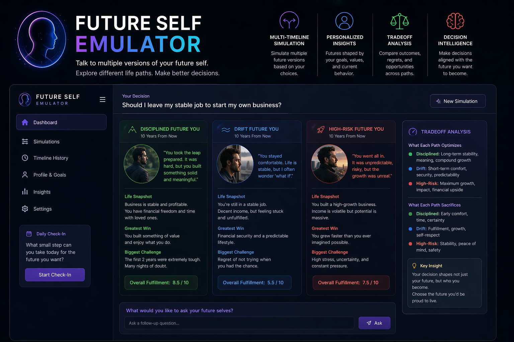

# Future Self Emulator

> Talk to multiple versions of your future self across different life paths to make better long-term decisions.

---


## 🧠 What is this?

**Future Self Emulator** is an AI-powered decision intelligence system that simulates multiple plausible future versions of you based on different choices you might make today.

Instead of asking:
> “What should I do?”

You explore:
> “Who will I become if I do A vs B vs C?”

---

## ⚙️ Core Idea

Most decision tools:
- give advice
- predict outcomes
- or summarize options

This system is different:

It **simulates identity trajectories over time**.

You interact with:
- 🟢 Disciplined Future You
- ⚪ Drift / Passive Future You
- 🔴 High-Risk / Aggressive Future You

Each has lived experience, regrets, and outcomes shaped by your choices.

---

## 🧬 System Overview

            ┌──────────────────────┐
            │   User Input         │
            │ (Decision Context)   │
            └─────────┬────────────┘
                      │
                      ▼
            ┌──────────────────────┐
            │ Future Simulation    │
            │ Engine (LLM Core)    │
            └─────────┬────────────┘
                      │
    ┌─────────────────┼─────────────────┐
    ▼                 ▼                 ▼
┌──────────────┐ ┌──────────────┐ ┌──────────────┐
│ Disciplined  │ │ Drift Future │ │ High-Risk    │
│ Self         │ │ Self         │ │ Self         │
└──────────────┘ └──────────────┘ └──────────────┘
│                 │                 │
└──────────┬──────┴──────┬─────────┘
▼
┌──────────────────────────┐
│ Tradeoff + Insight Layer │
└──────────────────────────┘

---

## 🚀 Features

- 🧠 Multi-timeline future simulation
- 🔁 First-person perspective future selves
- ⚖️ Tradeoff analysis between life paths
- 📊 Decision consequence breakdown
- 🧾 Profile-based personalization
- 🔌 API for LLM integration (tool/function calling ready)

---

## 💡 Example

### Input

> “Should I leave my stable job to start a business?”

---

### Output

#### 🟢 Disciplined Future You
> “You stayed, built financial stability, and invested slowly. Life is predictable but secure. You sometimes wonder ‘what if’, but stress is low.”

#### ⚪ Drift Future You
> “You delayed decisions. Years passed. Opportunities passed too. Comfort replaced ambition.”

#### 🔴 High-Risk Future You
> “You left the job, struggled early, but eventually built something meaningful. Stress was high, but so was growth.”

---

### 🧠 Final Insight

- Stability reduces stress but limits upside  
- Drift creates regret accumulation  
- Risk creates volatility but higher potential fulfillment  

---

## 🖥️ Tech Stack

- Frontend: React + TailwindCSS
- Backend: FastAPI
- LLM: OpenAI / compatible models
- Database: PostgreSQL / SQLite (MVP)
- Deployment: Vercel + Railway

---

## 📡 API Usage

### Endpoint

```http
POST /simulate

## Request
{
  "profile": "string",
  "decision": "string"
}
## Response 
{
  "result": "future self simulation output"
}

If you want to run this simulation locally and privately, check out my other project, MaximusX. https://github.com/shehanmakani/MaximusX
